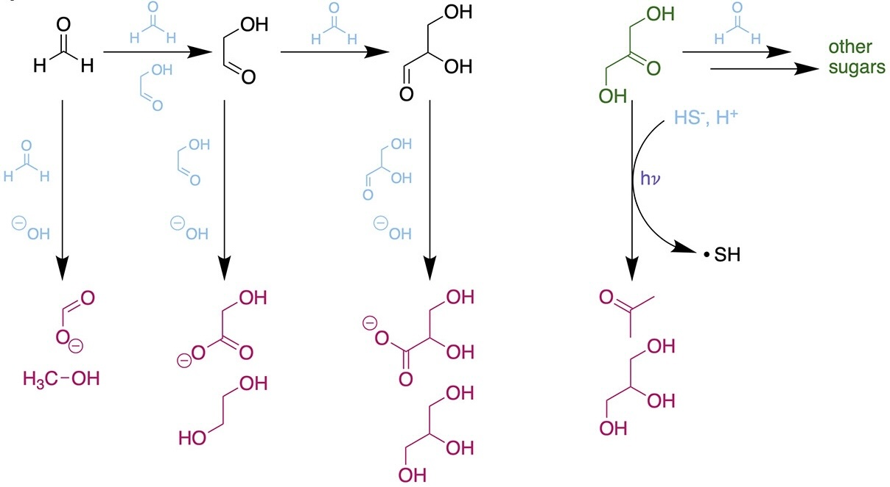

# Cambridgeator
A Chemical Oscillator Practical for the PSLU MPhil.

## Learning Goals for this Practical

- Words.
- Words.

## Pre-Practical Motivation and Review

> The supreme property of chemical matter is its potency to have given rise to the emergence of life.  
>               -- Albert Eschenmoser (2007, Tetrahedron, 63(52), 21821)

> Life has to be a set of molecules that can mutually catalyze one another’s formation.  
>               -- Stuart Kauffman, [Interview with Jim Rutt](https://jimruttshow.blubrry.net/the-jim-rutt-show-transcripts/transcript-of-episode-18-stuart-kauffman-on-complexity-biology-t-a-p/)

The origin of life problem involves the transition from chemistry to biology. We can explore the edges of this transition by seeing how chemistry can exhibit certain life-like behavior. Life undergoes cycles, such as circadian cycles and biochemical cycles, metabolic cycles and reproductive cycles. Chemistry can also undergo cycles. Chemical cycles are not evidence of life, but they are examples where chemical matter exhibits certain life-like properties. For this reason, it is valuable to understand how these cycles behave, and what conditions give rise to them.

In addition, the chemistry of biology is by necessity autocatylitic: its molecules promote those reactions that produce more of those same molecules. This is the essence of chemical self-replication. Autocatalytic chemistry has been discovered in abiotic systems.

**The formose reaction, showing interfering side reactions, from Rimmer & White, 2024, Accounts of Chemical Research, [https://doi.org/10.1021/acs.accounts.4c00247](https://pubs.acs.org/doi/10.1021/acs.accounts.4c00247)**

## Practical 1: The Iodine Clock Experiment

Words.

### The Goals of this Practical

Words.

### An approximate description of the reaction.

Words.

### The Experiment

Words.

### The Measurements

Words.

## Practical 2: The Chemical Oscillator

Words.

### Description of the Oscillator:
The Cambridgeator, which is really just the Brusselator set up to compare with the Iodine clock experiment, follows these reactions involving the chemical species A, B, D, E, X and Y, with rate constants $k_1$, $k_2$, $k_3$, and $k_4$, as such:

$$
\begin{align}
{\rm A} &\rightarrow {\rm X} & k_1 \\
{\rm 2X + Y} &\rightarrow {\rm 3X} & k_2 \\
{\rm X + B} &\rightarrow {\rm Y + D} & k_3\\
{\rm X} &\rightarrow {\rm E} & k_4
\end{align}
$$

**Student Question: What is the overall reaction?**  
**Student Question: Which step is the autocatylitic step?**  
Holding the concentrations [A], [B], [D] and [E] constant, the concentrations [X] and [Y] change according to the rate equations:

$$
\begin{align}
\frac{d[{\rm X}]}{dt} &= k_1 [{\rm A}] + k_2 [{\rm Y}] [{\rm X}]^2 - k_3 [{\rm B}] [{\rm X}]  - k_4 [{\rm X}], \\
\frac{d[{\rm Y}]}{dt} &= k_3 [{\rm B}] [{\rm X}] - k_2 [{\rm X}]^2 [{\rm Y}], \\
\end{align}
$$

**Student Question: What is the system's steady state?**  
**Student Challenge Question: Is the steady state stable or unstable?**  
Words.
